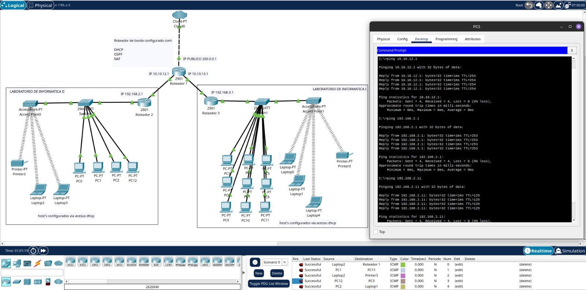

# 🏛️ Universidade Santo Agostinho — Projeto de Rede MAN

Este projeto foi desenvolvido no **Cisco Packet Tracer** para simular a infraestrutura de rede acadêmica da **Universidade Santo Agostinho**, interligando diferentes setores do campus universitário, com serviços locais, roteamento dinâmico e conectividade simulada com a Internet.

---

## 📖 Contexto

O projeto contempla a configuração de uma rede **MAN acadêmica**, que conecta dois laboratórios de informática distintos, centralizados em um **roteador de borda**, que realiza funções essenciais de:

- **DHCP** (atribuição automática de endereços IP para os hosts)
- **OSPF** (roteamento dinâmico entre os roteadores internos)
- **NAT** (tradução de endereços privados para acesso à Internet)

---

## 🖧 Estrutura da Rede

### 🌐 Roteador de Borda (Roteador 1)

- IP Público: `200.0.0.1`
- Rede interna 1: `10.10.12.1/24` (conexão com Laboratório de Informática II)
- Rede interna 2: `10.10.13.1/24` (conexão com Laboratório de Informática I)

Funções configuradas:

- NAT Overload
- DHCP
- Roteamento OSPF
  

---

### 📡 Testes de Conectividade e Acesso

### 🧑‍💻 Laboratório de Informática II

- Roteador 2 (Gateway da rede): `192.168.2.1/24`
- Switch de distribuição: modelo **2960**
- Acesso via **DHCP** para todos os hosts
- Dispositivos conectados:
  - PCs (PC0, PC1, PC2, PC12)
  - Laptops (Laptop2, Laptop3)
  - Impressora de rede (Printer3)

---

### 🧑‍💻 Laboratório de Informática I

- Roteador 3 (Gateway da rede): `192.168.3.1/24`
- Switch de distribuição: modelo **29124TT**
- Acesso via **DHCP** para todos os hosts
- Dispositivos conectados:
  - PCs (PC5 até PC11)
  - Laptops (Laptop0, Laptop1, Laptop4)
  - Impressora de rede (Printer0)

---
